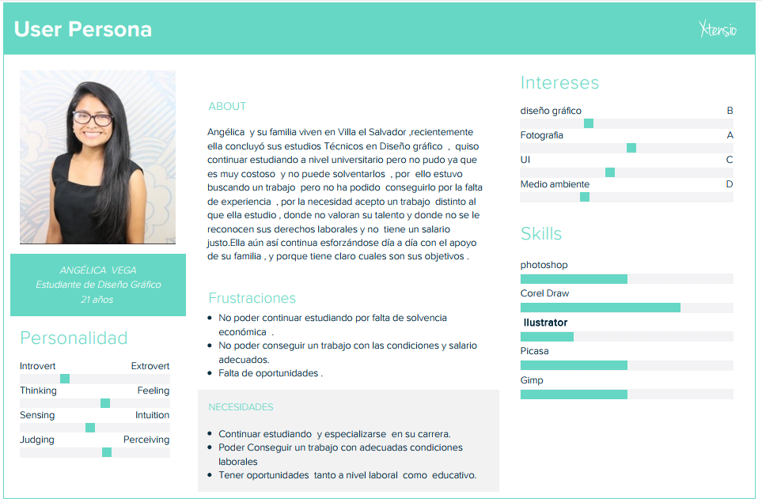

# ENTREVISTAS ONLINE
Plataforma para realizar entrevistas online diseñado  para Laboratoria .

### CONTEXTO
Esta plataforma es creada para ayudar al equipo de Laboratoria y a la training Manager  a gestionar el manejo del proceso de entrevistas a las postulantes, actualmente  las entrevistas  se realizan  personalmente con las psicólogas , para mejorar  este proceso creamos  esta plataforma  , donde las entrevistas a las postulantes podrán realizarse de manera online  (audio y video) ,facilitando  a la vez el manejo de la información .

### PÚBLICO OBJETIVO
-	Trainig Manager de Laboratoria
-	Postulantes

### STAKEHOLDERS
- Equipo de Laboratoria
- Training Manager
- Administrador
- Psicólogas
- Equipo de desarrollo
- Postulantes

## DESCUBRIMIENTO E INVESTIGACIÓN

### USER PERSONA 1
(Trainig Manager)

### USER PERSONA 2
(Postulante)

### PROBLEM STATEMENTS

**TRAINING MANAGER**

**{Alejandra}** quisiera poder mejorar el manejo y gestión de cada etapa del proceso de selección para ahorrar tiempo y recursos.

**{Alejandra}** quisiera  poder manejar toda la información del proceso de selección de las postulantes de una manera eficiente y fácil.

**{Alejandra}** quisiera tener toda la información del proceso de entrevistas de las postulantes.

**{Alejandra}** quisiera poder  visualizar la cantidad de postulantes que son aptas o no  para la etapa de las  entrevistas.

**POSTULANTE**

**{Angélica}** quisiera poder tener más oportunidades laborales.

**{Angélica}** quisiera poder encontrar un trabajo con las condiciones adecuadas.

**{Angélica}** quisiera poder tener más oportunidades educativas y continuar con sus estudios.

### HOW MIGHT WE (HMW)

**¿Cómo podríamos**  lograr mejorar la etapa del proceso de entrevistas a las postulantes?

**¿Cómo podríamos**  brindarle toda la información del proceso de entrevistas de una manera sencilla y eficiente?

**¿Cómo podríamos**  lograr que sea visible la cantidad  de postulantes que son aptas o no para la etapa de entrevistas?
